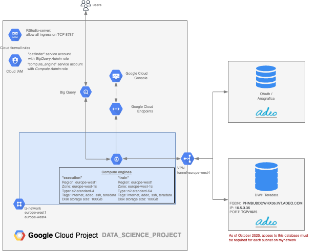

# Terraform for Data Science

In this folder we collect the Terraform configurations to set up a GCP project for data science activities
In particular, the schema of the project created with these instructions is the following:



The script creates the instances and creates service accounts with required permissions.

The Terraform state is stored in a Google Cloud Storage bucket whose name is always formed by the project-id with the postfix `-terraform`.
This bucket is automatically locked and encrypted and only project owners can access it.
## Requirements
### Software

* Terraform >= 0.12.4
* Gcloud cli

### Landing Zone and permissions

* To be able to run this instructions it is required to have already created a `
Landing Zone v2` using [Spootnik](https://spootnik.adeo.cloud/execution-environment/cloudservices/new-landingzone) 
with Adeo connection flag set to `Yes`and being the project owner on GCP

* The user that runs these commands must also be `LandingHub Network User` on the `lh-itlm` project-hub.

### Usage

Before being able to launch the deploy procedure you need to create two files with required variables and the bucket that will contain the Terraform state:

* Create a file named  `tf.variables` with the following variable:
  * `PROJECT`= {{PROJECT_ID}}

In this file one can also change the default values of the variables defined in `vars.tf`

* Create a file named `tf.backend` where you set the path to save Terraform's states and plans:
  * `bucket` = "{{PROJECT_ID}}-terraform"
  * `prefix` = "terraform/state/gke/{{PROJECT_ID}}"

* Initialize credentials with gcloud:
  ```
  gcloud auth login
  gcloud auth application-default login
  ```

At this point Terraform will automatically use personal credentials of the user to perform operations.
One could also create a Service Account to run these instructions but for development and test we suggest not to do it to avoid the proliferation of service accounts.
```
gcloud config set project {{PROJECT_ID}}
gsutil mb -l europe-west1 gs://{{PROJECT_ID}}-terraform/
terraform init -backend-config=tf.backend ### if required, do NOT copy the existing state
terraform plan -var-file=tf.variables
terraform apply -var-file=tf.variables
```

By the end of the process, you will get as output the `datafinder` service account with its key. 
